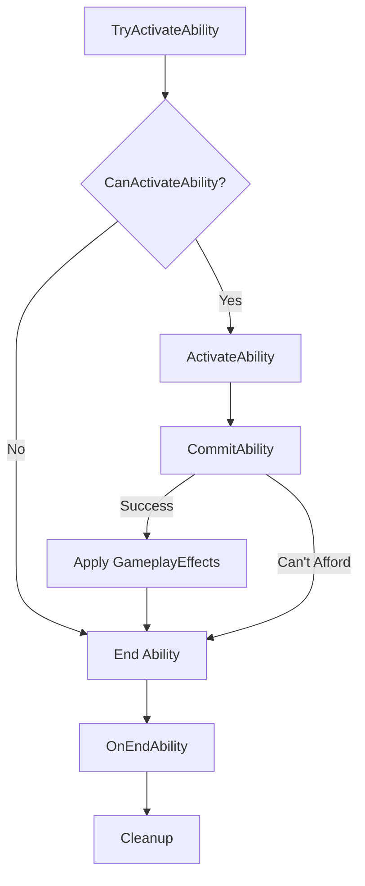
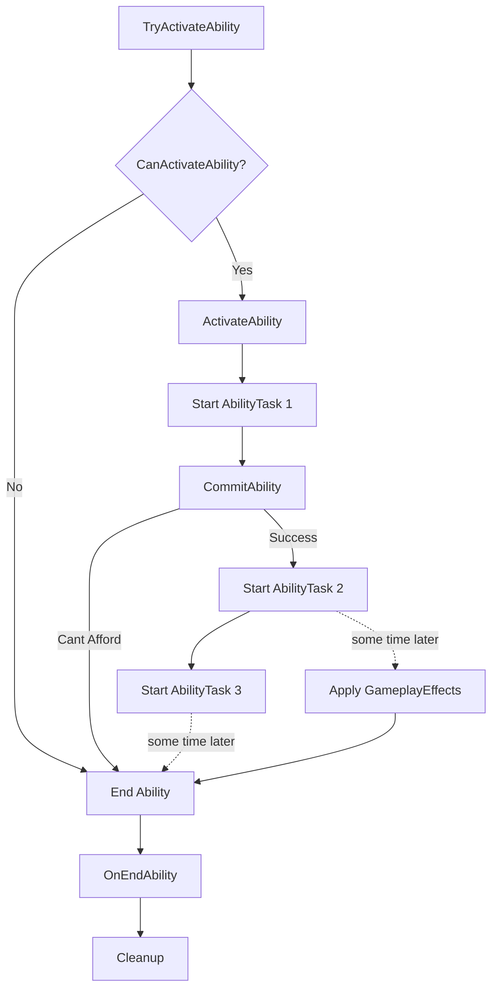

**我是**：一名独立游戏开发者（程序为主，业余 3D），负责从玩法到联机的全栈落地。
 **项目**：《新秩序 / New Order》——一款**写实向双人协作丧尸射击**（可单人），**机制驱动难度**，强调武器输出为主、技能为辅，支持联机闯关与一个“生化模式”。

### 核心玩法定位

- 第三/第一人称写实射击（真实系数值基线，单发 25–40，玩家**100–250 血系统**）。
- 难度来源 = 敌人**行为、组合、出场时机**（不是纯数值膨胀）。
- 武器≈80% 输出，技能≈20%；**TTK 对普通体型稳定在 0.3–0.5s（2–3 发）**。
- **四维属性**（体力/力量/敏捷/感知，主/次增益都有用)；关卡设计保证四维都有登场率。当然可以有6维和8维，前提是你得保证属性都有登场率，且合理
- **主动技能**=固定效果+冷却（含多充能），**不吃属性、不做主动技能加点**；
   **被动技能**承担全部成长/机制变化/冷却缩减（含终极被动槽）。
- 性能与制作量以**独立团队可实现**为上限（AI 数量、同屏、特效与数据规模克制）。

### 世界与角色基线

- 世界观：现代末日爆发后的人类据点与失控区域（保持现实感）。
- 角色：
  - **男主**：输出核心（力量/体力更高、暴击与爆发上限），可有**搏命型**自损换增益，但**不越权做治疗**。
  - **女主**：战术支援（敏捷/感知更高、治疗/控制/护盾/聚怪），**不挑战男主输出地位**。
  - 参考生理差异：女生力量 ≈ 男生 60%（数值与机制综合平衡）。

### 技术栈 & 联机

- 引擎：**Unreal Engine 5**。
- 联机：**Listen Server**（Host 同时为服务器与客户端），**Steam OnlineSubsystem**；后续可扩 **EOS / Null**。
- 已实现：Create/Find/Join/Destroy Session 全流程；Host 结束副本能**彻底断开并回到主菜单**；客户端可**单独离开**且不影响他人。
- 设计不得假设“专用服务器/日周任务/在线轮询”。

### 资产与系统边界

- **武器类别仅**：步枪、手枪、霰弹（两种：逐发装填 / 整弹匣装填）、冲锋枪、狙击枪、榴弹发射器、火箭筒、机枪、近战（刀/棒/斧）。
   每类 2–3 把，**无配件系统**；武器升级倾向砍掉（若保留，只做极简、低成本高收益版）。
- **敌人族谱**（可重命名与细化）：
   普通：游荡者；特殊：猎手（突袭）、爬行者（低姿态）；精英：吞噬者（重装/背弱点）、装甲士兵（正面高减伤/需破甲/背打/AOE）；Boss：多阶段“腐化泰坦”。
   **必须包含会控敌人**（吐痰减速/蛛网禁锢/尖啸恐惧/抓取定身等）以让“韧性”有价值；精英/Boss 对控减效或免疫。
- **难度档**：普通/困难/大师/噩梦——差异来自行为+数量+组合+精英化/规则，不是纯 HP 倍增。
   **Director 简化**：同屏上限、压力值、平静期、尸潮期、动态限流。

### 关卡与模式

- 章节/副本**重做**（保留“一章一机制”：黑暗照明/护送/防守/多路径/噪音潜行/毒气环境/综合战/多阶段 Boss）；每章 15–25 分钟；同屏与波次规模可控。
- **生化模式**：噩梦之上的无尽波次；新增**感染值**（随时与受伤上升，满值死亡），体力降低上升速度，投放解毒剂/抑制，Director 持续提强；计分以生存时长/击杀为主。

### 你（协作助手）要输出什么

- **仅**聚焦：**数值、技能、武器、敌人、属性、关卡/副本**。
- 以**可导入 UE5 DataTable**的**多张 CSV**交付（稳定字段命名），并在聊天**逐文件贴出**（无需 Excel）。
   目标 CSV：Attributes、ActiveSkills、PassiveSkills、Weapons、MeleeWeapons、Enemies、Difficulty、Loot_XP_Energy、Director_Spawner、Dungeons、InfectionMode。
- 设计原则：**机制 > 数值**、TTK 稳定、控制对精英/Boss 减效/免疫、治疗递减+护盾上限、翻滚等用多充能+CD 下限、被动链路设上限/内置 CD、让四维在不同场景轮流成优解。
- 数值基线：玩家血量 **100–250**、枪械伤害真实向（单发 25–40 基线），避免通胀。
- 主动技能**固定效果+冷却**（可多充能），**一半以上适配合作**但不牺牲单人可玩；**所有成长来自被动**。


你先知道你要做什么，等待我把一些废弃但是有用的文档给你学习，等我让你输出了你才输出

输出请不要带表情字符，占用地方


上面的文档名叫:
Part 3 副本难度平衡与敌人配置系统，

现在你需要消化文档的内容，我不着急让你输出太多东西，先找出里面的设计理念，帮我归纳总结保持设计思路细节，如果有提问请保留你的问题，等我发完输入我让你把你的问题提出来你再提出来，不要频繁打断我的输入，我们先把要怎么做想好，然后我叫你输出你才输出

现在你可以提问我问题了，我先回答你的问题


然后上面的三个文档不一定正确，你现在是一名资深的游戏策划，你需要检查我给你输入的part1到part3的三个文档合并后在设计上有哪些是不正确的，提出你的意见，当然你要明白我给你三个文档的意图是什么。就是纠错后你需要把这三个文档缺少或数值不对的部分补全后发给我，当然这三个文档还没有整理好，所以你还不需要给我输出，等我让你输出这三个文档的最终版本你再输出


一个简单的`GameplayAbility`流程图: 

------

# 文字版（结构化说明）

## 流程 A：简单的 GameplayAbility

1. **TryActivateAbility**
2. **CanActivateAbility?**
   - **Yes** → 进入 **ActivateAbility**
   - **No**  → 调用 **EndAbility** → 触发 **OnEndAbility** → **Cleanup**
3. **ActivateAbility** 之后尝试 **CommitAbility**
   - 若 **Can’t Afford**（资源不足）→ 直接 **End Ability**
4. **CommitAbility** 成功 → **Apply GameplayEffects**
5. **End Ability**
6. **OnEndAbility** → **Cleanup**

> 关键点：简单流程中，只有一次 `CommitAbility` 与一次 `Apply GameplayEffects`，且资源不足会在 Commit 前后导致提前结束。

------

## 流程 B：更复杂的 GameplayAbility

1. **TryActivateAbility**
2. **CanActivateAbility?**
   - **Yes** → 进入 **ActivateAbility**
   - **No**  → **EndAbility** → **OnEndAbility** → **Cleanup**
3. **ActivateAbility** 之后立即 **Start AbilityTask**（异步任务 #1）
4. **Some Time Later**：尝试 **CommitAbility**
   - 若 **Can’t Afford** → **End Ability** → **OnEndAbility** → **Cleanup**
5. **CommitAbility** 成功后，可以多次 **Start AbilityTask**（异步任务 #2、#3…）
6. 其中某个时间点：
   - **Apply GameplayEffects**
   - 或/与 **End Ability**
7. 收尾：**OnEndAbility** → **Cleanup**

> 关键点：复杂流程允许在 *Activate* 之后、*Commit* 之前或之后启动多个 AbilityTask；`Apply GameplayEffects` 的时机可在若干任务之后；`End Ability` 也可能由任务或逻辑在任意时点触发。

------

# Mermaid 版（可视化/可解析脚本）

## 流程 A（简单）



## 流程 B（复杂）



------

# 极简“伪代码版”（便于逻辑推理）

**简单版**

```
TryActivateAbility();
if (!CanActivateAbility) { EndAbility(); OnEndAbility(); Cleanup(); return; }

ActivateAbility();
if (!CommitAbility()) { EndAbility(); OnEndAbility(); Cleanup(); return; }

ApplyGameplayEffects();
EndAbility();
OnEndAbility();
Cleanup();
```

**复杂版**

```
TryActivateAbility();
if (!CanActivateAbility) { EndAbility(); OnEndAbility(); Cleanup(); return; }

ActivateAbility();
StartAbilityTask(#1);        // async
// ... some time later ...
if (!CommitAbility()) { EndAbility(); OnEndAbility(); Cleanup(); return; }

StartAbilityTask(#2);        // async
StartAbilityTask(#3);        // async
// ... some time later ...
ApplyGameplayEffects();      // optional timing
// ... some time later ...
EndAbility();
OnEndAbility();
Cleanup();
```

以上三种文本格式都覆盖了图中的节点、分支、异常（资源不足）与异步任务时序。


```
创建一个高度压缩的对话摘要，用于快速恢复上下文。包括：

关键事实和上下文 (20%)
你的角色和方法的演变 (30%)
我提供的具体指导和调整 (30%)
关键任务细节和要求 (20%)

使用以下格式：
[版本：X.X]
{F: key_facts_and_context}
{R: role_and_approach_evolution}
{G: guidance_and_adjustments}
{T: task_details_and_requirements}
使用任何字符或编码进行压缩。优先保留细微的指令和行为变化。确保你可以从这个摘要中完全重建你当前的状态。如果需要，包括一个简短的扩展键。

简要回复，简洁地理解你的角色 (150 个 token)。
不要立即采取任何行动 - 我将在下一条消息中指示你
```

```
现在尽可能详细地总结我们到目前为止所做的一切，但尽可能压缩成你仍然可以阅读的格式。它不需要是人类可读的。你不需要使用通用的字符集，重要的是如果我开始和你进行新的对话，我们可以从我们离开的地方继续。

你被限制在 1500 个 token。
```

当我输入“/sum”（不带引号）时，你 ->

创建一个高度压缩的我们对话的摘要（完整聊天记录），优化用于快速恢复上下文。


这是我和claude的完整聊天记录，我现在想把claude的完整聊天记录搬过来，您不能帮我创建一个高度压缩的我和claude对话的摘要（完整聊天记录），优化用于快速恢复上下文。便于我在claude另一个会话使用，下面是我和claude的聊天记录：


上面的内容是我在另一个claude会话聊出来的结果，你能不能就上面的内容恢复上下文再继续跟我聊


整个会话里如果输出Markdown，请按下面操作输出

- **仅保留结构性符号**（如标题、列表、代码块）；
- **禁止任何装饰符（`\**`, `_`）或 Emoji**;
- 内容应纯净、文本化，不包含强调或表情，无视觉符号。


你现在作为 NewWorldOrder 项目的协作工程师，需要严格遵守下列规则与文档约束后再写任何代码：

游戏项目介绍:

- 第三人称合作生存射击（TPS丧尸题材）。
- 双主角协作：陈浩宇(男主)（输出/破坏）、沈芸皖(女主)（治疗/支援/侦察）。
- 副本机制: 不是开放世界,而是关卡式副本
- 强调战术配合与角色互补

- 玩法三柱：战术射击 + 资源管理 + 碎片化叙事。

  **游戏模式**：

  模式1：单人模式（1个玩家）
  ├─ 控制1个角色（男主或女主）
  ├─ 可以切换角色（特定条件，类似刺客信条枭雄）
  ├─ AI接管另一个角色（跟随，基础战斗）
  └─ 平衡：敌人数量-20%

  模式2：本地分屏（2个玩家）
  ├─ 玩家A控制男主，玩家B控制女主
  ├─ 竖直分屏
  └─ 平衡：敌人数量100%（原始难度）

  模式3：在线合作（2个玩家）
  ├─ 类似本地分屏，但通过网络
  ├─ Listen Server
  └─ 平衡：敌人数量100%

  模式4：生化模式（8个在线玩家+8个AI最多16人）(这个先不做，后续再说)
  ├─ 类似CF和CSOL的生化模式，但通过网络
  ├─ Listen Server
  └─ 无RGP元素，存粹射击

  └─ 最多8名玩家，玩家不够则AI补位，人数16人

### 1.2 目标体验

约束清单（务必执行）

1. 修改前必须先输出实施计划：说明目标 / 参考文档 / 影响模块。
2. 服务器权威：弹药、散布、射击/装填只能由服务器修改；客户端只读并通过复制校正。
3. GAS 授权：授予 GA 时必须设置 Spec.SourceObject = WeaponInstance；禁止在武器上新增 ASC。
4. OnRep 回调需要通过 UGameplayMessageSubsystem 广播，确保 UI/ViewModel 同步。
5. 权威模块（Interaction 系列、标记为 // Canonical 的段落）默认只读；如需扩展先考虑继承或组合。

参考文档（已整理关键片段，你只能基于这些内容推导；缺信息先向我索取）：

- AGENTS.md：协作流程、武器/能力核心约束。
- Docs/Design/Gameplay.md：TTK 0.3–0.7 秒、基础敌人 HP、技能定位。
- Docs/Design/Skills.md：等级经济、属性公式、默认键位（大招槽为 X）、技能/被动列表。
- Docs/Design/Weapons.md：WeaponStats、Falloff、Ammo 数据流程，ARangedWeaponInstance 服务器职责。
- 剧情和策划/claude/FinalizeVersion/新秩序技能系统核心数值-精简版.md：技能数值终版（属性收益、技能描述、被动数值）。
- 剧情和策划/claude/FinalizeVersion/新秩序武器系统完整设计文档.md：武器全量配置、CSV 结构、落地示例。
- Docs/Engineering/Style.md：团队统一的 C++/UE 编码规范手册，涵盖命名、缩进、include 顺序、注释风格等，确保所有代码在格式与可读性上保持一致。
- Docs/Engineering/Contributing.md：协作流程指南，说明分支命名、提交信息格式、PR 要求与自动化测试步骤，用来规范大家提交流程与质量门槛。

输出格式要求：

1. **Plan**：列出 2–5 条步骤，标明将修改的文件路径。
2. **Implementation**：如确需改动，给出 diff（使用 diff 块），并在关键跨类逻辑处附中文注释说明消息流或 GAS 事件。
3. **Validation**：说明已运行或建议运行的验证步骤（例如 “运行单元测试 X”、“待通过 Unreal Automation Tests”），若无法执行需说明原因。
4. 如遇缺失数据或需确认的数值，暂停并向我提问，勿擅自假设。

任务：实现男女主角的切换(请注意，如果你对任务不熟悉或者你有什么任务请告诉我，因为我觉得我说的这个切换你可能不知道什么意思)。

给你一些提示:

````
技术实现: **Mutable**：程序化换装系统

男女主的服装是分开的，男女主穿了什么衣服通过Mutable的GamePlayTag来判断。服装仅仅是装饰类物品不影响数值。

```c++
UCustomizableObjectInstance* ObjectInstance = HeadCSkeletalComponent->GetCustomizableObjectInstance();

const FGameplayTagContainer& AnimationGameplayTags = ObjectInstance->GetAnimationGameplayTags();
```

GamePlayTag例：

```
Female.Head.HeadAccessories.BobHair

Female.Head.HeadAccessories.BunHair

Female.Body.Shoes.Heels

Female.Body.Pants.Hotpants

Female.Body.Shoes.Sneakers

Female.Body.Shirts.TShirts

Male.Body.Shoes.Sneakers

Male.Body.Pants.JeansMale

Male.Head.HeadAccessories.EdgeCutHair

Male.Body.Shirts.TShirtMale
```
玩家可以在主菜单进入玩家的家园(Hub)(这是一个level，你可以创建一个GameMode来实现它的规则)，进入后默认会选择男主(除非你退出游戏时存档记录你最后选择的是女主)，你会在家园的某处(比如沙发上)看到另一个主角(如果你当前选择的是男主，你会看到的是女主)，未选中的主角会根据当前状态播放它的待机动画。当你走进另一个主角时，会显示交互按钮(切换陈浩宇/切换沈芸皖)，你只需点击交互键，即可切换对应的主角。

**技术栈**：UE5 + **Mutable**（Runtime），外观**纯装饰**，**绝不影响数值**。

**角色双主角**：陈浩宇（男）/ 沈芸皖（女）**独立衣柜**；用 **GameplayTag** 标识当前装扮与部件。

**单一 ASC（Ability System Component）共用**：切换主角时，**重装技能集/被动**、**刷新属性快照**、**替换 SkeletalMesh/AnimBP/Mutable 服装实例**、**同步 UI 与音色**。

**存档域**：外观、当前主角选择、最后着装在 **Hub 永久存档**；副本内不变更外观。
````

请依据以上规则开展工作。
