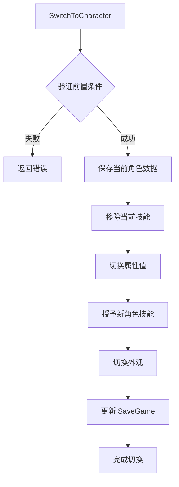

# 角色切换项目上下文

**note_id**: `character-switching-001-context`
**category**: CharacterSwitching
**status**: ✅ Active
**last_updated**: 2025-11-11

## 概述

本文档记录角色切换功能的项目上下文，包括已实现的基础设施、待实现的功能、命名规范、以及常见陷阱。

**阅读本文档的目的**：在开始角色切换功能开发前，了解项目的现状，避免重复实现已有功能或使用错误的命名规范。

## 实现状态总览

###  已实现的基础设施

| 组件 | 位置 | 说明 |
|------|------|------|
| **SaveGame 系统** | `Source/NewWorldOrder/Public/System/ShootSaveGame.h` | 完整的双角色存档结构 |
| **外观切换** | `Source/NewWorldOrder/Public/Character/MutableAppearanceComponent.h` | `SwitchGender()` 完整实现 |
| **AttributeSet** | `Source/NewWorldOrder/Public/AbilitySystem/Attributes/ShootAttributeSet.h` | 4层架构单一 AttributeSet |
| **PlayerState 性别标记** | `Source/NewWorldOrder/Public/Player/ShootPlayerState.h` | `SetCharacterGender()` 已实现 |

### 待实现的功能

| 功能 | 预计工作量 | 优先级 |
|------|----------|--------|
| **Attribute 重命名** | 1-2天 | 高 |
| **角色切换核心逻辑** | 3-4天 | 高 |
| **技能系统集成** | 2-3天 | 中 |
| **状态清理逻辑** | 1-2天 | 中 |

## GameplayTag 命名规范

### 重要：本项目的命名约定

**正确的命名规范**（基于 `Config/DefaultGameplayTags.ini`）：

```ini
# 角色能力套件标签
Abilities.Kit.Protagonist.Male
Abilities.Kit.Protagonist.Female

# 能力类型标签
Ability.Type.Action        # 主动技能（需要在切换/退出副本时取消）
Ability.Type.Passive       # 被动技能

# GameplayCue 标签
GameplayCue.Weapon.Rifle.Fire
GameplayCue.Character.Death

# 输入标签
InputTag.Ability.Primary
InputTag.Ability.Secondary

# UI 层级标签
UI.Layer.HUD
UI.Layer.Menu
UI.Layer.Modal
```

**错误的命名**（本项目不使用）：

```ini
# 不要使用 Combat.* 前缀
Combat.Ability.Melee
Combat.Ability.Ranged

# 不要使用 Skill.* 前缀代替 Ability.*
Skill.Type.Active
Skill.Type.Passive
```

### GameplayTag 使用场景

```cpp
// 角色切换时需要使用的标签
FGameplayTag MaleKitTag = FGameplayTag::RequestGameplayTag(TEXT("Abilities.Kit.Protagonist.Male"));
FGameplayTag FemaleKitTag = FGameplayTag::RequestGameplayTag(TEXT("Abilities.Kit.Protagonist.Female"));

// 取消主动技能时需要匹配的标签
FGameplayTag ActionAbilityTag = FGameplayTag::RequestGameplayTag(TEXT("Ability.Type.Action"));
```

## AttributeSet 架构

###  单一 AttributeSet 设计

本项目使用 **单一 `UShootAttributeSet`** 而非分离的 Meta/Combat AttributeSet。

**位置**: `Source/NewWorldOrder/Public/AbilitySystem/Attributes/ShootAttributeSet.h`

**4层分类**：

```cpp
UCLASS()
class UShootAttributeSet : public UAttributeSet
{
    GENERATED_BODY()

public:
    // ===== 第1层：Primary Attributes (主要属性) =====
    UPROPERTY(BlueprintReadOnly, Category = "Primary Attributes")
    FGameplayAttributeData Strength;          // 力量

    UPROPERTY(BlueprintReadOnly, Category = "Primary Attributes")
    FGameplayAttributeData Intelligence;       // 需要改名为 Vitality (生命力)

    UPROPERTY(BlueprintReadOnly, Category = "Primary Attributes")
    FGameplayAttributeData Resilience;         // 需要改名为 Agility (敏捷)

    UPROPERTY(BlueprintReadOnly, Category = "Primary Attributes")
    FGameplayAttributeData Vigor;              // 需要改名为 Perception (感知)

    // ===== 第2层：Secondary Attributes (次要属性) =====
    UPROPERTY(BlueprintReadOnly, Category = "Secondary Attributes")
    FGameplayAttributeData Armor;              // 护甲

    UPROPERTY(BlueprintReadOnly, Category = "Secondary Attributes")
    FGameplayAttributeData CriticalHitChance;  // 暴击率

    UPROPERTY(BlueprintReadOnly, Category = "Secondary Attributes")
    FGameplayAttributeData BlockChance;        // 格挡率

    // ... 其他次要属性

    // ===== 第3层：Vital Attributes (生命属性) =====
    UPROPERTY(BlueprintReadOnly, Category = "Vital Attributes")
    FGameplayAttributeData Health;             // 当前血量

    UPROPERTY(BlueprintReadOnly, Category = "Vital Attributes")
    FGameplayAttributeData MaxHealth;          // 最大血量

    UPROPERTY(BlueprintReadOnly, Category = "Vital Attributes")
    FGameplayAttributeData Mana;               // 需要移除（项目不使用法力值）

    UPROPERTY(BlueprintReadOnly, Category = "Vital Attributes")
    FGameplayAttributeData MaxMana;            // 需要移除

    // ===== 第4层：Meta Attributes (元属性) =====
    UPROPERTY(BlueprintReadOnly, Category = "Meta Attributes")
    FGameplayAttributeData IncomingDamage;     // 传入伤害（临时）

    UPROPERTY(BlueprintReadOnly, Category = "Meta Attributes")
    FGameplayAttributeData IncomingXP;         // 传入经验（临时）
};
```

### Attribute 重命名任务

**必须执行的重命名**（高优先级）：

| 当前名称 | 新名称 | 原因 |
|---------|--------|------|
| `Intelligence` | `Vitality` | 更符合动作游戏设定 |
| `Resilience` | `Agility` | 更符合动作游戏设定 |
| `Vigor` | `Perception` | 更符合动作游戏设定 |

**需要移除的属性**：

- `Mana` - 本项目不使用法力值系统
- `MaxMana` - 本项目不使用法力值系统

**影响范围**：

1. `ShootAttributeSet.h` / `.cpp` - 属性定义和宏
2. `ShootSaveGame.h` - `FCharacterSnapshot` 结构体
3. 所有引用这些属性的 C++ 代码
4. 所有引用这些属性的 Blueprint
5. 所有 GameplayEffect 资产

## SaveGame 结构

### 双角色存档设计

**位置**: `Source/NewWorldOrder/Public/System/ShootSaveGame.h`

```cpp
// 单个角色的快照数据
USTRUCT(BlueprintType)
struct FCharacterSnapshot
{
    GENERATED_BODY()

    UPROPERTY(SaveGame, BlueprintReadWrite)
    int32 AttributePoints = 0;

    // Primary Attributes (需要跟随 AttributeSet 重命名)
    UPROPERTY(SaveGame, BlueprintReadWrite)
    float Strength = 0;

    UPROPERTY(SaveGame, BlueprintReadWrite)
    float Intelligence = 0;  // 需要改名为 Vitality

    UPROPERTY(SaveGame, BlueprintReadWrite)
    float Resilience = 0;    // 需要改名为 Agility

    UPROPERTY(SaveGame, BlueprintReadWrite)
    float Vigor = 0;         // 需要改名为 Perception

    UPROPERTY(SaveGame, BlueprintReadWrite)
    int32 SkillPoints = 0;

    // 已保存的技能数据
    UPROPERTY(SaveGame, BlueprintReadWrite)
    TArray<FSavedAbility> SavedAbilities;
};

// 玩家存档（包含双角色数据）
UCLASS()
class UShootSaveGame : public USaveGame
{
    GENERATED_BODY()

public:
    UPROPERTY(SaveGame, BlueprintReadWrite)
    ECharacterGender CurrentGender = ECharacterGender::MALE;

    UPROPERTY(SaveGame, BlueprintReadWrite)
    FCharacterSnapshot MaleSnapshot;

    UPROPERTY(SaveGame, BlueprintReadWrite)
    FCharacterSnapshot FemaleSnapshot;

    UPROPERTY(SaveGame, BlueprintReadWrite)
    int32 PlayerLevel = 1;

    UPROPERTY(SaveGame, BlueprintReadWrite)
    int32 XP = 0;
};
```

**关键设计**：

- 双角色快照分离（`MaleSnapshot` / `FemaleSnapshot`）
- 共享 `PlayerLevel` 和 `XP`
- 记录当前性别 `CurrentGender`
- 每个角色独立的 `AttributePoints` 和 `SkillPoints`

## 外观切换系统

### MutableAppearanceComponent

**位置**: `Source/NewWorldOrder/Public/Character/MutableAppearanceComponent.h`

**核心方法**：

```cpp
UCLASS(ClassGroup=(Custom), meta=(BlueprintSpawnableComponent))
class UMutableAppearanceComponent : public UActorComponent
{
public:
    // 性别切换（已完整实现）
    UFUNCTION(BlueprintCallable, Category = "Appearance")
    void SwitchGender(ECharacterGender NewGender);

private:
    UPROPERTY()
    UCustomizableObjectInstance* MaleInstance;

    UPROPERTY()
    UCustomizableObjectInstance* FemaleInstance;

    UPROPERTY()
    UCustomizableSkeletalComponent* BodyCSkeletalComponent;

    UPROPERTY()
    UCustomizableSkeletalComponent* HeadCSkeletalComponent;

    UPROPERTY()
    USkeletalMeshComponent* HeadMesh;

    TSoftClassPtr<UAnimInstance> MaleAnimClassPtr;
    TSoftClassPtr<UAnimInstance> FemaleAnimClassPtr;
};
```

**实现逻辑**：

```cpp
void UMutableAppearanceComponent::SwitchGender(ECharacterGender NewGender)
{
    if (NewGender == ECharacterGender::MALE && MaleInstance)
    {
        // 切换到男性
        BodyCSkeletalComponent->SetCustomizableObjectInstance(MaleInstance);
        HeadCSkeletalComponent->SetCustomizableObjectInstance(MaleInstance);
        HeadMesh->SetAnimInstanceClass(MaleAnimClassPtr);
    }
    else if (NewGender == ECharacterGender::FEMALE && FemaleInstance)
    {
        // 切换到女性
        BodyCSkeletalComponent->SetCustomizableObjectInstance(FemaleInstance);
        HeadCSkeletalComponent->SetCustomizableObjectInstance(FemaleInstance);
        HeadMesh->SetAnimInstanceClass(FemaleAnimClassPtr);
    }

    // 更新 PlayerState 中的性别标记
    if (AShootPlayerState* ShootPlayerState = GetPlayerState())
    {
        ShootPlayerState->SetCharacterGender(NewGender);
    }
}
```

**关键特性**：
- Mutable 系统集成（CustomizableObject）
- 自动切换 Body 和 Head 的 CustomizableObjectInstance
- 自动切换动画蓝图
- 自动更新 PlayerState 性别标记

## 角色切换核心逻辑设计

### 需要实现的功能

**位置**: `Source/NewWorldOrder/Public/Player/ShootPlayerState.h`

```cpp
// 待实现的核心方法
UCLASS()
class AShootPlayerState : public AModularPlayerStateCharacter
{
public:
    // 角色切换主方法
    UFUNCTION(BlueprintCallable, Category = "Character")
    void SwitchToCharacter(ECharacterGender NewGender);

private:
    // 验证切换前置条件
    bool ValidateSwitchPreconditions() const;

    // 保存当前角色数据
    void SaveCurrentCharacterData();

    // 切换技能
    void SwitchAbilities(ECharacterGender NewGender);

    // 切换属性
    void SwitchAttributes(ECharacterGender NewGender);

    // 切换外观（调用 MutableAppearanceComponent）
    void SwitchAppearance(ECharacterGender NewGender);
};
```

### 切换流程



### 前置条件

```cpp
bool AShootPlayerState::ValidateSwitchPreconditions() const
{
    // 1. 不在副本中
    if (IsInDungeon())
    {
        return false;
    }

    // 2. 不在战斗中
    if (IsInCombat())
    {
        return false;
    }

    // 3. ASC 已初始化
    if (!AbilitySystemComponent)
    {
        return false;
    }

    return true;
}
```

## 状态清理逻辑

### 退出副本时的清理

```cpp
// 待实现：OnExitDungeon
void AShootPlayerState::OnExitDungeon()
{
    if (!AbilitySystemComponent)
    {
        return;
    }

    // 1. 取消所有 Ability.Type.Action 技能
    FGameplayTagContainer ActionAbilityTags;
    ActionAbilityTags.AddTag(FGameplayTag::RequestGameplayTag(TEXT("Ability.Type.Action")));
    AbilitySystemComponent->CancelAbilities(&ActionAbilityTags);

    // 2. 移除所有非永久 GameplayEffect
    //    (保留 Ability.Type.Passive 相关的 Effect)
    // TODO: 实现临时 Effect 清理逻辑

    // 3. 重置 Health 到 MaxHealth
    const float MaxHealth = AbilitySystemComponent->GetNumericAttribute(
        UShootAttributeSet::GetMaxHealthAttribute()
    );
    AbilitySystemComponent->SetNumericAttributeBase(
        UShootAttributeSet::GetHealthAttribute(),
        MaxHealth
    );
}
```

## 快速开始清单

### 第一步：Attribute 重命名

1. 读取 `ShootAttributeSet.h`
2. 读取 `ShootSaveGame.h`
3. 重命名 `Intelligence` → `Vitality`
4. 重命名 `Resilience` → `Agility`
5. 重命名 `Vigor` → `Perception`
6. 移除 `Mana` 和 `MaxMana`
7. 更新 `FCharacterSnapshot` 中的对应字段
8. 搜索并更新所有引用
9. 编译并测试

### 第二步：添加 GameplayTag

1. 编辑 `Config/DefaultGameplayTags.ini`
2. 添加 `Abilities.Kit.Protagonist.Male`
3. 添加 `Abilities.Kit.Protagonist.Female`
4. 添加 `Ability.Type.Action`（如果不存在）
5. 添加 `Ability.Type.Passive`（如果不存在）

### 第三步：实现切换核心逻辑

1. 在 `ShootPlayerState.h` 声明 `SwitchToCharacter()`
2. 实现 `ValidateSwitchPreconditions()`
3. 实现 `SaveCurrentCharacterData()`
4. 实现 `SwitchAbilities()`
5. 实现 `SwitchAttributes()`
6. 调用 `MutableAppearanceComponent::SwitchGender()`
7. 更新 `USaveGameSubsystem` 存档

## 常见陷阱

### 陷阱1：使用错误的 GameplayTag 命名

```cpp
// 错误：使用不存在的前缀
FGameplayTag WrongTag = FGameplayTag::RequestGameplayTag(TEXT("Combat.Ability.Melee"));

// 正确：使用项目约定的前缀
FGameplayTag CorrectTag = FGameplayTag::RequestGameplayTag(TEXT("Ability.Type.Action"));
```

**后果**：标签无法匹配，技能系统无法正常工作。

### 陷阱2：尝试分离 AttributeSet

```cpp
// 错误：创建多个 AttributeSet
UCLASS()
class UMetaAttributeSet : public UAttributeSet { ... };

UCLASS()
class UCombatAttributeSet : public UAttributeSet { ... };

// 正确：扩展现有的单一 AttributeSet
UCLASS()
class UShootAttributeSet : public UAttributeSet
{
    // 使用分类（Category）区分属性层级
};
```

**后果**：破坏现有架构，导致存档系统不兼容。

### 陷阱3：在 Character 上实现切换逻辑

```cpp
// 错误：在 Character 上实现
void AShootCharacter::SwitchGender(ECharacterGender NewGender)
{
    // Character 可能会被销毁/重新生成
}

// 正确：在 PlayerState 上实现
void AShootPlayerState::SwitchToCharacter(ECharacterGender NewGender)
{
    // PlayerState 在玩家会话期间持久存在
}
```

**后果**：Character 销毁时丢失切换状态。

### 陷阱4：忘记保存当前角色数据

```cpp
// 错误：直接切换不保存
void AShootPlayerState::SwitchToCharacter(ECharacterGender NewGender)
{
    SwitchAbilities(NewGender);      // 丢失当前角色的技能数据！
    SwitchAttributes(NewGender);     // 丢失当前角色的属性数据！
}

// 正确：先保存再切换
void AShootPlayerState::SwitchToCharacter(ECharacterGender NewGender)
{
    SaveCurrentCharacterData();      // 先保存
    SwitchAbilities(NewGender);
    SwitchAttributes(NewGender);
}
```

**后果**：切换后无法恢复之前角色的状态。
