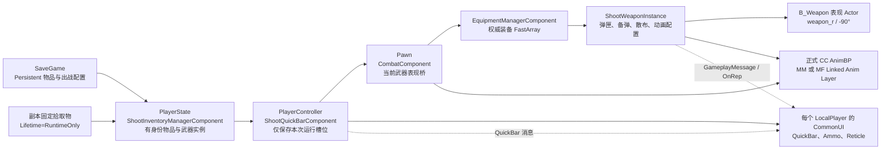
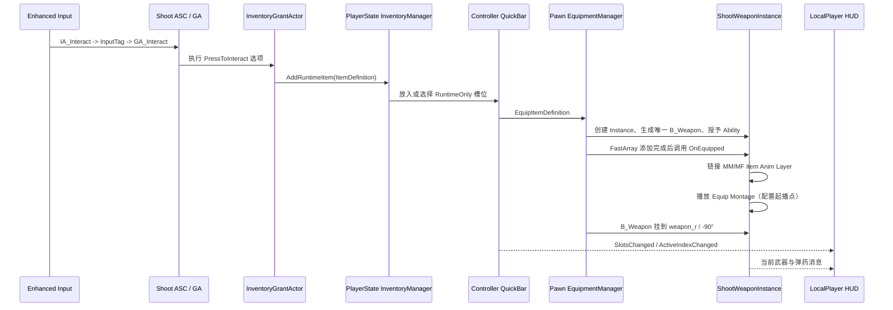
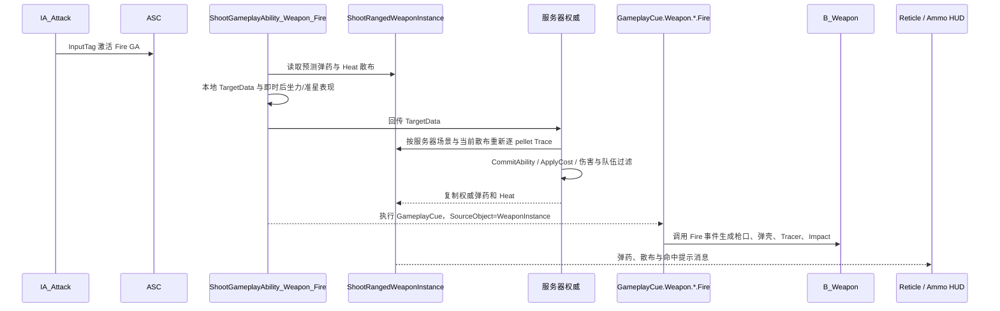
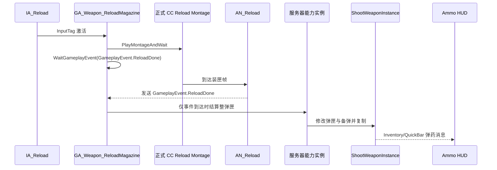

# Lyra ShooterCore 适配总览

## 目标

在 NewWorldOrder 项目层完成可维护、可扩展、可由玩家验收的 Lyra ShooterCore 适配。实现应以 Lyra 的分层动画、GAS 武器能力、CommonUI 和多人边界为参考，但必须适配本项目的 CC 男女主骨架、Mutable 外观和库存生命周期设计。

最终玩家闭环包括：

- HomeMap 选择主角并进入 `TestMap_SplitScreen`，分屏主角互斥且各自状态隔离；
  `TestMap_ListenServer` 专用于一台机器一个本地玩家的 Listen Server 回归。
- PlayerState 保留 Persistent 仓库；Controller 持有 RuntimeOnly QuickBar；Pawn 只承担装备表现桥。
- 固定点交互拾取 Rifle、Pistol、Shotgun，能够换枪、丢枪并进入空手状态。
- 三把武器通过 GAS 完成射击、整弹匣换弹、弹药权威结算和本地 UI 预测显示。
- 角色具备空手和持枪移动、方向切换、跳跃、下落、落地、蹲伏、开火、换弹、装备与卸下动画。
- 武器表现、角色动画层、CommonUI 准星、散布、本地后坐力和敌人靶标同步工作。
- 单人、两人本地分屏和 Listen Server 均通过可重复验收。

## 不可突破的边界

- 不修改 Unreal Engine 源码或上游插件源码。
- 不引入 Lyra 的 WeaponStateComponent。
- 不实现 Lyra 级别的命中反馈与严格命中校验。
- 保留现有 `UShootGameplayAbility_Weapon_Fire` TargetData 回传流程。
- 服务器权威继续由 `CommitAbility`、`ApplyCost` 和服务器弹药状态保证。
- 不破坏角色头发层、鞋子层和表演 Pose 插槽。
- 正式运行时动画只使用 `/Game/Characters/Heroes/CC/MM` 和 `/Game/Characters/Heroes/CC/MF` 下绑定对应 CC 骨架的资产。
- 不因修复一个动画而在角色 AnimBP 中增加按武器枚举分支；武器差异必须由动画层或武器配置提供。
- 仅在确实需要用户移动资产或手工配置 Lyra 蓝图资产时请求协作。

## 项目职责架构

职责必须按图保持单向：PlayerState 是可持久化物品与武器实例的仓库，Controller 的 QuickBar 只描述本次运行选择，Pawn 不保存账号仓库，只把当前 Equipment/WeaponInstance 接到角色动画与 B_Weapon 表现。HUD 只订阅所属 LocalPlayer 的消息和当前 WeaponInstance，不读取全局第一个玩家。

准星的唯一运行链为：本地 `PlayerController` 上的 `UShootHUDReticleComponent` 以
`LocalPlayer` 为 Context 向 `HUD.Slot.Reticle` 注册一枚 `UShootReticleHostWidget`；Host
从所属玩家的 QuickBar 获取精确的当前 `UShootRangedWeaponInstance`，再根据 ItemDefinition
配置创建唯一子准星。切枪只替换 Host 的 Slate 子控件，不反复向 UIExtension 注册每把枪的
准星类。Listen Server 上的远端服务器 Controller 没有 LocalPlayer，因此不会创建玩家私有 UI。

## GameplayTag 与武器调用链

### 拾取、装备与切枪

Listen Server 上 QuickBar Guid、Inventory Item UObject、Equipment FastArray 和 WeaponInstance Instigator 没有跨通道顺序保证。项目只在“FastArray 已到但 Instigator 尚未到”的复制窗口记录一次待补状态；Instigator 到达后只补播 Equip Montage，不重复链接动画层、显隐武器或重入装备事件。

### 射击、散布与表现

客户端 TargetData 用于保持输入响应和即时表现，但服务器不直接信任客户端命中结果；服务器按自己的世界和散布重新 Trace。项目刻意不引入 Lyra WeaponStateComponent、未确认命中队列或独服级严格命中校验。

### 整弹匣换弹

Montage 自然结束只收束本地预测能力，不能代替 `GameplayEvent.ReloadDone` 结算；中断或取消也不得补弹。Rifle、Pistol、Shotgun 复用同一能力语义，各自的 Notify 时间由正式 CC Montage 配置。

### 丢枪与空手

`IA_WeaponDrop -> InputTag.Weapon.Drop -> UShootGA_DropWeapon -> QuickBar 移除当前 RuntimeOnly 槽位 -> EquipmentManager Unequip -> UShootWeaponInstance::OnUnequipped -> Generic Unequip Montage`。若仍有武器，QuickBar 按顺序选择下一槽并重新进入 Equip 链；最后一把丢弃后 ActiveIndex 为 `-1`，角色进入正式 Unarmed Linked Anim Layer，掉落物仍可通过相同交互链重拾。

## 动画重建原则

最初异常不是单个蒙太奇的局部问题。旧实现只迁移了 `FullBody_Aiming`，却把它叠在旧的移动状态机上，缺少 Lyra 完整的移动阶段、跳跃阶段、左手姿势和骨骼控制职责。截图中的方向切换卡帧、双腿异常、蹲伏姿势、橡皮手臂和左手脱离护木均与这个不完整边界一致；但后续 CC 骨架复核表明，橡皮手还可能同时包含重定向后的 twist/corrective 分配缺失，不能把所有变形归因于单个蒙太奇或 `weapon_r`。

2026-09-10 的 CC PostProcess A/B 表明，重定向主链正确并不等于 CC 网格的最终变形正确。组合后处理在皱纹 AnimBP 之后使用 Pose Driver 和复制适配的 Control Rig，把修正分配到 CC 的前臂、上臂、大腿和小腿 twist 骨；因此代表性的手腕扭曲和疑似橡皮手目前暂时看上去已解决，但仍必须按真实武器动作、运动状态、视角和 LOD 扩展回归。完整原理与证据见 [CC PostProcess 适配记录](../AnimationMigration/CC_PostProcess_适配记录.md)，任务状态见 [Lyra ShooterCore 适配状态](Status_状态.md)。

本任务已按以下顺序重建并验收：

1. 先确定正式 CC 主 AnimBP、动画层接口和武器动画层的唯一运行时入口。
2. 对照 Lyra 的 Idle、Start、Cycle、Stop、Pivot、Jump、Fall、Land 图层职责迁移，不混用旧状态机的武器布尔分支。
3. 在基础移动稳定后接入 LeftHandPose、HandIK 和必要的 FootPlant/LegIK；任何骨骼控制都必须可单独关闭并通过前后截图验证。
4. 最后接入 Fire、Reload、Equip、Unequip 蒙太奇和 Gameplay Event Notify，避免用错误蒙太奇掩盖基础姿势问题。
5. 正式入口验收通过且引用扫描为零后，才删除旧目录和探针资产。

## 弹药与 UI 原则

- 武器实例是弹匣和备弹的权威数据源，HUD 只能通过 QuickBar 消息或 `UShootWeaponInstance` 读取。
- 客户端可以预测显示本次射击后的弹药，但服务器复制状态必须能够纠正显示。
- 整弹匣换弹必须对齐 Lyra `GA_Weapon_ReloadMagazine`：正式 Reload Montage 的装匣帧由 `/Game/Characters/Heroes/Abilities/AN_Reload` 发送 `GameplayEvent.ReloadDone`，服务器收到事件后结算；Montage 自然结束只收束本地预测实例，中断或取消不得补弹。未来逐发装填武器使用独立 InsertShell/ReloadDone 时序，不与整弹匣能力混用。
- 修改弹药逻辑前必须核对 Lyra 的预测、消耗和复制链，先证明问题在能力、Notify、复制还是 ViewModel。

## 目录策略

- 正式角色目录保持 `/Game/Characters/Heroes/CC/MM` 和 `/Game/Characters/Heroes/CC/MF`，不绑定可能变化的角色姓名。
- `CC` 暂不改名为 `CharacterCreator`，避免在功能尚未验收时制造大量 Redirector 和路径噪声。
- `/Game/Assets/Characters/CC/ChenHaoYu/Animations`、`/Game/Assets/Characters/CC/ShenWanYun/Animations` 和 `/Game/Developers/Codex/AnimPoseProbe` 已在正式入口 PIE 和引用扫描通过后删除，不得重新作为运行时 fallback。
- 后续删除 Mannequin 动画或 Rig 前仍必须同时满足：正式替代资产存在、复合资产与类型引用扫描为零、单人和分屏验收通过。

## 完成定义

“代码已写”“资产已生成”或“编译通过”都不单独代表功能完成。每一项只有同时满足以下条件才标记完成：

- 代码和资产配置进入唯一正式主线。
- 冷编译通过。
- 在真实 PIE 输入下完成对应操作。
- 关键状态有日志或截图证据。
- 单人通过后，涉及玩家私有状态的功能还需通过分屏；涉及复制的功能还需通过 Listen Server。
- 文档、提交和远端分支均已更新。

## 当前审计入口

- 进度与阻断：`Status_状态.md`
- 起点 `0262c45a` 到当前终点的保留、纠正、回撤和二进制概览：`Audit_终点审计.md`
- 玩家验收矩阵：`Verification_验收.md`
