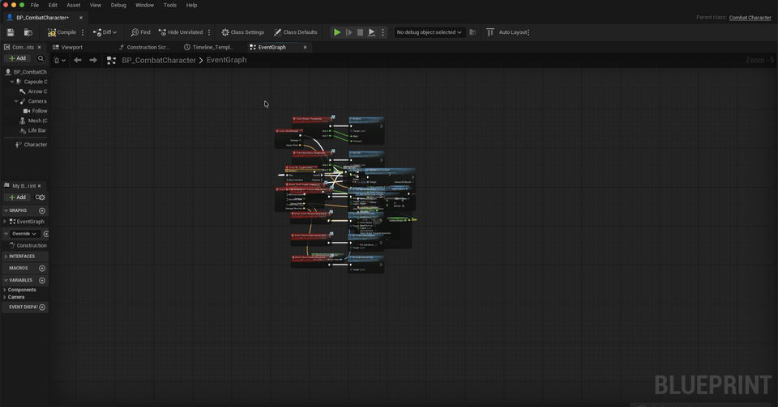

# Blueprint Anti-Pasta

*(Formerly Blueprint Auto Layout — blueprint spaghetti met its match.)*

Pin-aware auto-layout for Unreal Engine Blueprint graphs. Press **Ctrl/Cmd+Shift+L** or use the **toolbar dropdown** → the algorithm rearranges your nodes into a readable left-to-right execution flow.



The wire handling up close:


**New in v0.6.0 — a real layered (Sugiyama) engine.** The layout is now computed by a proper layered-graph algorithm instead of a single-parent tree, so it handles the cases a tree can't model:

- **Cross-row connections, multi-consumer data, and long edges** no longer snake or hump. Nodes are ranked into columns by execution depth (data providers pulled to just left of what they feed), edges that span more than one column get **dummy waypoints** so they route straight through a reserved lane, and a crossing-minimization sweep orders each column.
- **Pin-aware Brandes-Köpf coordinate assignment** straightens the white execution spine on the actual pin Y — exec links drive the alignment, so the spine reads as one clean horizontal line and data wires bend to meet it (rather than the whole thing averaging into a diagonal).
- **No node ever lands on top of another** — columns reserve their own width and rows their own height.
- **New in v0.6.1 — long edges are knot-routed.** An edge that spans more than one column is rewired through reroute (knot) nodes along its reserved lane, so it draws as straight segments instead of one long curved spline. The knots are tagged and regenerated each layout, so they never accumulate (toggle in Settings).

The engine is implemented from the published papers (Sugiyama et al.; Brandes & Köpf 2002 + 2020 erratum) as a standalone, unit-tested core. Auto-grouping into named, keyword-colored comment boxes and opt-in knot rerouting remain on top of it.

## Actions

Three ways to reach these: the **toolbar combo-dropdown**, **right-click on empty graph space**, or the **keyboard shortcuts** noted below.

The shared **Alex Coulombe Presents** entry point also lists this plugin alongside other installed ACP plugins; its best-effort toolbar-button visibility is unverified.

- **Auto Layout Graph** — arranges the graph (straighten & move by default). Also bound to **Ctrl/Cmd+Shift+L**; the toolbar button runs this by default.
- **Auto Layout Selected** — arranges only the selected nodes, in place. Also bound to **Ctrl/Cmd+Shift+K**. (Greyed out in the toolbar dropdown when no nodes are selected; omitted entirely from the right-click menu in that case.)
- **Auto Layout & Group Graph** — arranges it *and* wraps each event/function subtree in a comment box automatically named after its root, colored by keyword (Damage→red, Spawn→green, …).
- **Auto Layout (Route Wires)** — arranges it *and* inserts reroute (knot) nodes so any wires that still cross a node bend around it (the knot fallback).
- **Auto Layout, Group & Route** — all of the above.

## Handles

- **Branches** (`Branch`, `Switch`, multi-output exec nodes) — sibling paths stack vertically in their own lanes without overlap
- **Sequence nodes** — each `Then` output gets its own vertical lane (so wires to later outputs don't cross earlier subtrees)
- **Pure (data-only) nodes** — clustered into a reserved column to the left of their consumer, chained pure nodes included, and single-consumer providers nudged to straighten their wire
- **Multi-event graphs** — each event/function root gets its own row
- **Reroute (knot) nodes** — treated as wire bends, repositioned onto the wire (at pin height) instead of cluttering the flow
- **Comment boxes** — resized and repositioned to keep wrapping the nodes they contain after everything moves
- **Variable-width nodes** — true rendered node sizes are used, not assumed averages

Built as a single editor module with no runtime cost. One undo step per layout.

📖 **Full documentation in the [Wiki](https://github.com/ibrews/blueprint-auto-layout/wiki)** — installation, usage, algorithm internals, configuration, troubleshooting, and roadmap.

## Why this exists

Before writing a line of this, we checked prior art — worth being upfront about, especially if you're comparing options for your own project. **[Graph Formatter](https://github.com/howaajin/graphformatter)** by Howaajin is a free, MIT-licensed, actively maintained Unreal plugin (170+ stars) that already does a proper layered (Sugiyama) layout with pin-aware Brandes–Köpf coordinate assignment — the same algorithm family this plugin's layered engine uses. If straight execution wires and clean columns are all you need, Graph Formatter already does that well and is a perfectly good choice; **no Graph Formatter code was used here** — this plugin's engine is implemented independently from the published papers.

Blueprint Anti-Pasta exists to go beyond that baseline:

- **Auto-grouping into named, keyword-colored comment boxes** (`Damage`→red, `Spawn`→green, `Begin`→blue, …) — Graph Formatter resizes comments you've already drawn; this plugin can wrap and auto-name your event/function subtrees for you, no typing required.
- **Opt-in knot (reroute node) routing as an explicit, visible mode** — a wire that still crosses a node after layout can be bent around it with tagged reroute knots, on demand, that regenerate rather than pile up on re-runs.
- **Three ways to trigger it** — a rebindable keyboard shortcut (Ctrl/Cmd+Shift+L / K), a toolbar combo-dropdown with a "sticky" last-used default, and a right-click context menu on empty graph space.
- **A verified compatibility matrix from UE 4.27 through 5.8**, most of it runtime-confirmed rather than just compiled — see [Engine support](#engine-support).

Neither tool does everything: neither handles Material/Niagara/Behavior-Tree graphs (Blueprint and Animation Blueprint only, here), and untangling a node with many inbound wires is an open problem for both (Graph Formatter's own docs say so). If you only need clean columns, Graph Formatter is the more mature, broader-scope tool. This plugin trades some of that scope for auto-grouping, knot routing, and a codebase built to be easy to read and demo in a classroom setting.

## Install

There is currently **no prebuilt binary release** — every entry on the [Releases page](https://github.com/ibrews/blueprint-auto-layout/releases) is a source tag, not a packaged plugin. Compile it yourself; both paths below are straightforward.

### Option A — drop into a project (fastest for class)

1. Clone (or copy) this repo into `<YourProject>/Plugins/blueprint-auto-layout/`.
2. Right-click your `.uproject` → **Generate Project Files**.
3. Build the project.
4. Launch the editor. The plugin loads automatically — no manual enable step.

### Option B — build a portable package with `RunUAT BuildPlugin`

Useful if you (as the instructor) want to hand students a pre-built plugin folder instead of asking everyone to compile:

```bat
:: Windows
"<EngineInstallDir>\Engine\Build\BatchFiles\RunUAT.bat" BuildPlugin ^
  -Plugin="<repo>\BlueprintAutoLayout.uplugin" ^
  -Package="<output-dir>\BlueprintAutoLayout" ^
  -Rocket
```

```sh
# macOS / Linux
"<EngineInstallDir>/Engine/Build/BatchFiles/RunUAT.sh" BuildPlugin \
  -Plugin="<repo>/BlueprintAutoLayout.uplugin" \
  -Package="<output-dir>/BlueprintAutoLayout" \
  -Rocket
```

Verified 2026-08-06 on UE 5.8, Windows: `BuildPlugin` reports `BUILD SUCCESSFUL` and the resulting module loads in the editor with zero errors. Drop the `-Package` output folder into `Engine/Plugins/Marketplace/` (available to every project on that engine install) or a single project's `Plugins/` folder, then enable it in **Edit → Plugins** if it isn't already active.

## Usage

In any Blueprint / Animation Blueprint / Macro graph:

- **Keyboard:** press **Ctrl/Cmd+Shift+L** to lay out the whole graph, or **Ctrl/Cmd+Shift+K** to lay out just the selected nodes. Both shortcuts are rebindable in **Editor Preferences → Keyboard Shortcuts → Blueprint Anti-Pasta**.
- **Toolbar:** click the **Auto Layout** combo button in the Blueprint editor toolbar to run Auto Layout Graph, or click the dropdown arrow to pick any of the five actions (see [Actions](#actions) above). Auto Layout Selected is greyed out when nothing is selected.
- **Right-click:** right-click empty graph space (not on a node or pin) and choose an action from the **Layout** section of the context menu — the same actions as the toolbar dropdown, minus Auto Layout Selected when nothing is currently selected.

Whichever way you trigger it, the change is wrapped in a single transaction — one `Ctrl+Z` undoes the entire layout. The grouping and routing actions add nodes to the graph (group comment boxes / reroute knots); the plain, selected, and group-only actions never delete your nodes.

The grouping actions color each comment box by reading keywords in its root node's title, so a graph's groups read at a glance — `Damage`/`Hit`→red, `Destroy`/`Death`→dark red, `Spawn`/`Create`→green, `Begin`/`Init`→blue, `Tick`/`Update`→teal, `Input`/`Pressed`→amber, `Overlap`/`Collision`→violet. Names with no keyword get a stable color derived from the title:


## Settings

**Editor Preferences → Plugins → Blueprint Anti-Pasta:**

- **Use layered (Sugiyama) engine** *(default: on)* — the v0.6.0 layered-graph engine (ranking, dummy waypoints, crossing minimization, pin-aware Brandes-Köpf). Turn off to fall back to the original single-parent tree layout.
- **Knot-route long edges** *(default: on, layered engine only)* — rewire multi-column edges through reroute knots along their reserved lane so they draw as straight segments. Turn off to leave long edges as plain (curved) wires.
- **Wire handling** *(default: Straighten & move nodes)* — how the plain layout actions (and the shortcut) handle wires:
  - **Straighten & move nodes** — keep wires straight and move nodes out of the way (Sequence lanes + pin-aligned data wires).
  - **Reroute with knots** — keep nodes put and bend wires around obstacles with reroute knots.
  - **Off** — lay out nodes but don't straighten, re-lane, or reroute any wires.
  - (The dedicated **Auto Layout (Route Wires)** menu actions always insert knots regardless of this setting.)
- **Pin-align tolerance** *(default 120)* — the maximum distance a node may be nudged vertically to line up a connected pin into a straight wire. Lower = nodes stay closer to their flow position (more wires left slightly diagonal); higher = more wires straightened.
- **Comment color mode** — **Keyword (semantic)** (default) colors group comments by title keyword; **Cycling palette** steps through a fixed palette instead.
- **Spacing** — horizontal, vertical, branch/lane, and event spacing (graph units) for tuning layout density.

## Engine support

Verified on **UE 4.27.2, 5.4.4, 5.5.4, 5.6.1, 5.7.4, and 5.8.0 (Win64)** — not just compiled clean (`RunUAT BuildPlugin`), but **runtime-verified**: the plugin was installed in a project, the project was upgraded engine-to-engine (4.27 → 5.4 → 5.5 → 5.6 → 5.7 → 5.8), and in each editor the plugin loads, the menu/toolbar/shortcut appear, and auto-layout actually rearranges a real Blueprint graph (single-step undo, no crash). Runtime layout confirmed on Win64 for 4.27–5.6 with before/after captures; 5.7 and 5.8 compile clean on Win64 and are runtime-confirmed by the maintainer (5.7/5.8 also covered on macOS).

UE 5.2 fails to compile on machines with MSVC 14.40+ due to a known incompatibility in UE 5.2's own engine headers (`ConcurrentLinearAllocator.h`) — not a plugin issue.
UE 5.3 is not covered (not installed on the verification machine).

*Independently re-confirmed 2026-08-06:* a fresh `RunUAT BuildPlugin` compile on UE 5.8, Windows, reports `BUILD SUCCESSFUL` and the module loads in the editor with zero errors — corroborating, not superseding, the runtime verification above.

## Things to Try

**No messy graph handy?** Open any Blueprint, or make a throwaway one with a `Branch`, a couple of `Print String` nodes, and a `Sequence`. Select all nodes (**Ctrl+A**) and drag them into a random pile. That's the single best demo in this whole plugin — the messier you make it, the more dramatic the fix.

1. Open a messy event graph. Press **Ctrl/Cmd+Shift+L** (or click the **Auto Layout** toolbar button). Watch nodes snap to a clean flow.
2. Press **Ctrl+Z** once. The entire layout reverts — the action is a single undo step.
3. Find a graph with a `Sequence` node. Run auto-layout. Each `Then` output now gets its own vertical lane, so the wire to a later output no longer cuts across an earlier output's nodes.
4. Find a node fed by a variable `Get`. Run auto-layout — the `Get` is nudged so its wire becomes a straight horizontal into the consumer's pin, while staying clear of the execution wire above it.
5. Select a handful of nodes, then press **Ctrl/Cmd+Shift+K** (or open the **Auto Layout** toolbar dropdown → **Auto Layout Selected**). Only those nodes are arranged, in place; the rest of the graph is untouched.
6. Open a graph with multiple events (`BeginPlay`, custom events, etc). Run auto-layout. Each event becomes its own row.
7. Add a `Branch` node mid-flow. Run auto-layout. The True/False paths stack vertically in their own lanes; the `Then` path takes the upper lane.
8. Open an Animation Blueprint's Event Graph. The same actions and shortcut work — the plugin attaches to all `UEdGraphSchema_K2`-derived schemas.
9. On a graph with several events, run **Auto Layout & Group Graph**. Each event's subtree is laid out and wrapped in its own comment box, auto-named after the event — no typing required.
10. Switch **Editor Preferences → Plugins → Blueprint Anti-Pasta → Wire handling** to **Reroute with knots**, then run **Auto Layout Graph** on a dense graph: instead of moving nodes, wires that cross a node are bent around it with reroute knots. Run it again — the knot count stays the same (re-runs don't accumulate). Switch back to **Straighten & move nodes** for the default behavior.
11. Instead of the toolbar or the hotkey, right-click empty graph space and run any action from the **Layout** section of the context menu — same five actions, no toolbar or keyboard required.

## Algorithm overview

Layout is a **layered (Sugiyama-style) pipeline** on an engine-agnostic core (no Unreal types, so it is unit-tested standalone), fed by an Unreal adapter:

1. **Build & measure** — classify nodes as exec/pure/branch/sequence/root (tagging reroute knots and comment boxes separately), read each node's **actual rendered size** from the open graph panel when available, gather every link (tracing through reroute knots to the real pins on the far side), and record which nodes each comment box currently wraps.
2. **Rank** — assign each node a column by longest-path over all links, so execution depth flows left-to-right; pure data sources (e.g. a variable `Get`) are pulled right to sit just left of what they feed.
3. **Dummies** — any edge spanning more than one column is split into a chain of dummy waypoints, reserving a straight lane so long wires don't cut across nodes.
4. **Order** — a median/barycenter sweep orders the nodes within each column to minimize wire crossings (components kept separate).
5. **Coordinates** — X from cumulative column widths; Y from **pin-aware Brandes-Köpf** — vertices align to their median *exec* neighbor on the connecting pin Y, forming straight blocks (the white spine), compacted with per-row minimum separation so nothing overlaps.
6. **Apply & finish** — write positions in a single transaction, then drop each reroute knot onto its wire (at pin height) and resize/reposition each comment box around its members.

When **Auto Layout & Group Graph** is used, a new comment box is then created around each root subtree, named after the root node's title and colored by matching keywords. When a **Route Wires** action is used, a final phase inserts reroute (knot) nodes on any wire that still crosses an intervening node; those knots are tagged so a re-run regenerates rather than accumulates.

The legacy single-parent tree packer is retained as a fallback (toggle in Settings). Spacing, the wire-handling mode, the pin-align tolerance, and comment color mode are exposed in **Editor Preferences → Plugins → Blueprint Anti-Pasta**; the remaining tuning constants live in `FBlueprintLayoutConfig` in `BlueprintAutoLayout.h`.

## Status

v0.6.9 — public, MIT licensed. Not yet on Fab.

**Renamed 2026-08-10 — Blueprint Auto Layout → Blueprint Anti-Pasta.** Display name only (`FriendlyName`, in-editor Settings/Keyboard-Shortcuts panel names, shared ACP launcher entry); the module name, C++ class names, repo, and license `ProductId` are unchanged. No functional change.

**v0.6.9 — runtime verification + multi-version load fixes.** Beyond the compile matrix, the plugin was installed in a real project and the project upgraded 4.27 → 5.4 → 5.5 → 5.6 → 5.7 → 5.8, confirming auto-layout works *at runtime* in each editor. This surfaced two gaps the compile-only checks missed: (1) the v0.6.7/0.6.8 toolbar combo used `TAttribute<FText>::CreateLambda`, a UE5-only API that broke the **4.27** build — switched to the portable `Create(FGetter::CreateLambda(...))` form; (2) the `.uplugin` pinned `EngineVersion: 5.7.0`, so the editor refused to load the plugin on any engine older than 5.7 (4.27/5.4/5.5/5.6) unless the user clicked "load anyway" — removed the pin so it loads cleanly across the supported range.

**v0.6.8 — sticky toolbar default.** Choosing any action from the dropdown promotes it to the button's primary click. The label updates to match ("Auto Layout", "Layout & Group", "Layout (Route)", "Layout, Group & Route"). Choice is persisted across editor restarts. "Auto Layout Selected" is intentionally excluded — it's selection-dependent.

**v0.6.7 — toolbar combo dropdown.** The single **Auto Layout** toolbar button is now a split combo button. Left-clicking still runs Auto Layout Graph; clicking the arrow opens a dropdown with all five actions — Auto Layout Graph, Auto Layout Selected (greyed out when nothing is selected), Auto Layout & Group Graph, Auto Layout (Route Wires), and Auto Layout, Group & Route.

**v0.6.6 — UE 4.27 support.** Added UE 4.27 compatibility guards and fixed a self-referential `BPAL_STYLE_SETNAME` macro that broke UE 5.x builds. Verified on UE 4.27.2, 5.4.4, 5.5.4, 5.6.1, 5.7.4, and 5.8.0 Win64.

**v0.6.5 — UE 5.4–5.8 verification.** Added version guards for `ResizeNode`/`BuildSettingsVersion` API differences across engine versions. Verified on UE 5.4.4, 5.5.4, 5.6.1, 5.7.4, and 5.8.0 Win64.

**v0.6.4 — straight first wire off each event.** Root events are the only un-anchored nodes in the layered result, so each is now snapped vertically to line its exec-output pin up with the first node it triggers — removing the slight downward slope that used to come off an event. (Where two events converge on one node, the merge still slopes for one of them — that's unavoidable.)

**v0.6.3 — refreshed documentation screenshots** to show the current layered-engine output (no functional change).

**v0.6.2 — coordinate fix.** A node fed by a long data chain (e.g. `Set Relative Location`, driven by a `Timeline` and a `float × float`) used to land far above its trigger, with the execution wire sweeping up to reach it. The Y assignment now anchors the execution spine to each node's predecessor (so a sink sits on its trigger's lane, exec wire straight) and pulls single-consumer data providers — including chained ones — onto the consumer's pins, so a node and its variables cluster together instead of the variables floating high.

Known limitations:
- **Long (multi-column) edges are routed through reroute knots** (v0.6.1) so they draw as straight segments rather than one curved spline. Pin positions feeding the lanes are *estimated* (not read from the live widget), so on complex multi-pin nodes (e.g. Timeline) a knotted lane can sit slightly off the exact pin and leave a gentle bend.
- **The layered engine ranks by longest path over all links** (no network-simplex balancing yet), so data-heavy graphs can be wider than strictly necessary; the exec spine stays straight regardless.
- No asset-action ("layout all graphs in this BP") — operates on the visible graph only.
- Material/Niagara/Behavior-Tree graphs aren't handled yet — Blueprint graphs only.

## License

MIT. Copyright (c) 2026 Alex Coulombe Presents.

## Support

If you like seeing this kind of thing get built and shared, [donations are always welcome](https://www.alexcoulombepresents.com/support) — they buy hardware, render time, and the freedom to keep giving most of this away.
