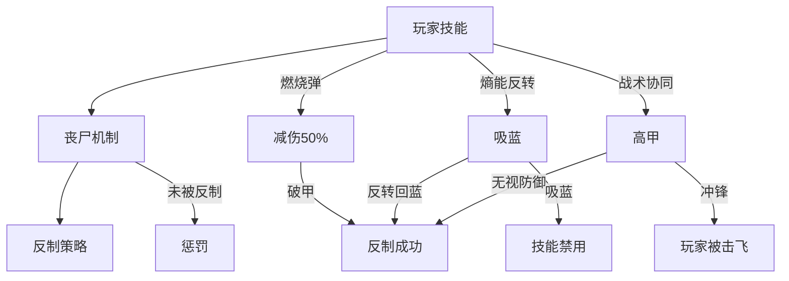
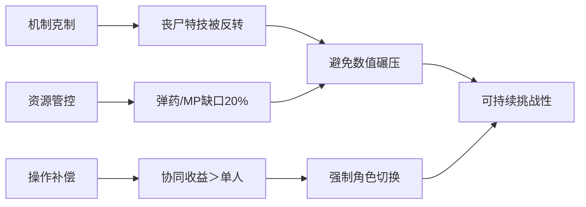

# MutableDemo-NewWorldOrder
新的游戏代码

"/Users/Shared/Epic Games/UE_5.8/Engine/Build/BatchFiles/Mac/GenerateProjectFiles.sh" -game -project="/Users/zhaoyijie/Documents/Unreal Projects/MyFirstGame/NewWorldOrder/NewWorldOrder.uproject"

"/Users/Shared/Epic Games/UE_5.8/Engine/Build/BatchFiles/Mac/GenerateProjectFiles.sh" -game -project="/Users/zhaoyijie/Documents/Unreal Projects/LyraStarterGame/LyraStarterGame.uproject"

git clone git@github.com:747897928/MyFirstGame.git

git config --global http.proxy 127.0.0.1:7890

git config --global https.proxy 127.0.0.1:7890

git config --global --unset http.proxy 

git config --global --unset https.proxy

git config --global --get http.proxy

git config --global --get https.proxy

git config -l --global

http.https://github.com.proxy=socks5://127.0.0.1:7890

On Windows, the ReSharper host cache files are kept in the**%LOCALAPPDATA%\JetBrains\Rider{version}\resharper-host\local\Transient\ReSharperHost\v{version}** folder.

The global settings are in **%APPDATA%\Roaming\JetBrains\RiderXXXX.X\resharper-host**. The IntelliJ global settings are stored in **%USERPROFILE%\AppData\Roaming\JetBrains\RiderXXXX.X****,** and the per-project settings in the solution local **.idea** folder.

On OSX and Linux, Rider stores the ReSharper host persistent settings in **~/.config/JetBrains/**, and ReSharper solution caches in **~/.local/share/JetBrains**. The IntelliJ global settings are stored in **~/Library/Application Support/RiderXXXX.X**, and per-project settings in the solution local **.idea** folder.

 

 As of 2018, on macOS the cache seems to be moved to ~/Library/Caches/Rider{version}.

C:\Users\用户名\AppData\Local\JetBrains\Rider2024.1\resharper-host\local\Transient\Rider\v241\SolutionCaches

~/Library/Caches/JetBrains/Rider2024.1/resharper-host/local/Transient/Rider/v241/SolutionCaches

%ENGINEVERSIONAGNOSTICUSERDIR%DerivedDataCache

%GAMEDIR%DerivedDataCache

C:\Users\Administrator\AppData\Local\UnrealEngine\Common\DerivedDataCache

/Users/zhaoyijie/Library/Developer/Xcode/DerivedData

C:\Users\wizard\AppData\Local\NewWorldOrder\Saved

访问steamDB，它是steam第三方Steam数据库，最多在线人数榜,在线人数飙升榜,热门新游榜,潜力新游榜,搜索同类竞品，看一眼低价区是怎么定价的。再参考下他们的打折频率和打折力度

# 《共生纪元：破晓》完整游戏策划案  
**第三人称射击+ARPG丧尸生存游戏 | 双角色协同作战 | 机制导向平衡设计**

---

## 一、核心系统框架
### 1. 角色成长系统（男女通用）
| **等级** | 血量(HP) | 蓝量(MP) | 升级经验 | 累计经验 | **成长率** |
| -------- | -------- | -------- | -------- | -------- | ---------- |
| 1        | 200      | 100      | 0        | 0        | -          |
| 10       | 450      | 200      | 1,200    | 1,700    | +5%/级     |
| 20       | 800      | 300      | 4,000    | 8,200    | +4.5%/级   |
| 30       | 1,200    | 400      | 8,000    | 22,200   | +3.3%/级   |

#### 2. 技能点与学习规则
| **项⽬**      | 数值                      |
| ------------- | ------------------------- |
| 技能点来源    | 升级1点/级 + 任务奖励10点 |
| 总技能点/角色 | 40点                      |
| 主动技能数量  | 4个（固定栏位）           |
| 被动技能数量  | 8个（需解锁）             |
| 技能最大等级  | 5级（主动）/3级（被动）   |

> **设计逻辑**：  
> - 总流程15-20小时（30级封顶）  
> - 蓝量成长＜血量成长，限制技能滥用  

---

## 二、战斗系统
### 1. 枪械数值表（男主主武器）
| **武器类型** | 单发伤害 | DPS(爆头) | 换弹(秒) | 爆头倍率 | **战术定位** |
| ------------ | -------- | --------- | -------- | -------- | ------------ |
| 突击步枪     | 35       | 350       | 2.5      | 2.0x     | 全能主力     |
| 霰弹枪       | 20×8     | 480       | 3.0      | 1.5x     | 近程爆发     |
| 狙击枪       | 120      | 240       | 4.0      | 3.0x     | 精英斩杀     |
| **轻机枪**   | 30       | 330       | 5.0      | 2.2x     | 火力压制     |

> **距离衰减**：-3%~8%/10米（狙击枪衰减最低）

### 2. 技能系统（双角色独立）
#### ▶ 男主技能树（暴力输出）
| **技能** | 1级效果           | 3级效果            | 5级（MAX）效果         | 蓝耗 | 冷却 | **质变点**  |
| -------- | ----------------- | ------------------ | ---------------------- | ---- | ---- | ----------- |
| 极限射击 | 射速+80%，持续5秒 | 射速+100%，持续7秒 | **不耗弹+120%射速**    | 80   | 40s  | 无限弹药    |
| 燃烧弹   | 60伤/秒，持续6秒  | 90伤/秒，持续7秒   | **破甲+120伤/秒**      | 30   | 25s  | 解除50%减伤 |
| 火力召唤 | 机械60伤/秒，10秒 | 90伤/秒，12秒      | **120伤/秒+继承50%HP** | 50   | 40s  | 生存强化    |

#### ▶ 女主技能树（机制辅助）
| **技能** | 1级效果          | 3级效果             | 5级（MAX）效果          | 蓝耗 | 冷却 | **质变点**     |
| -------- | ---------------- | ------------------- | ----------------------- | ---- | ---- | -------------- |
| 熵能反转 | 反转1个丧尸增益  | +反转1个玩家减益    | **反转2增益+1重度减益** | 50   | 35s  | 毒云→治疗池    |
| 战术协同 | 下3击无视20%防御 | 无视25%防御+减速10% | **无视30%防御+减速15%** | 40   | 25s  | 对装甲丧尸特攻 |
| 急救脉冲 | 群体+100HP       | +150HP+解流血       | **+200HP+解流血/中毒**  | 60   | 30s  | 高成本急救     |

> **技能点规则**：  
> - 40点/角色（30级升级+10任务奖励）  
> - 主动技能MAX需15点，被动MAX需9点  
> - **强制专精**：无法学满所有技能  

---

## 三、丧尸生态与反制链
### 1. 丧尸属性表
| **类型**     | 血量    | 伤害 | 移速 | **特殊机制**      | 出现等级 |
| ------------ | ------- | ---- | ---- | ----------------- | -------- |
| 普通丧尸     | 150-450 | 35   | 1.0  | 无                | 1-10     |
| 装甲丧尸     | 1,200   | 70   | 0.7  | 减伤50%           | 10-20    |
| 泰坦丧尸     | 5,000   | 450  | 1.2  | 冲锋（击飞+重伤） | 20-30    |
| **巢母丧尸** | 800     | 30   | 0.5  | 吸蓝（-10MP/秒）  | 15-25    |

### 2. 动态克制系统

### 3. Boss设计（刽子手）
| **阶段** | 技能     | 效果           | **反制策略**      |
| -------- | -------- | -------------- | ----------------- |
| P1       | 链钩拖拽 | 拉近+流血20/秒 | 急救脉冲解流血    |
| P2       | 血洞召唤 | 每20秒产3小怪  | 燃烧弹封洞口      |
| P3       | 能量虹吸 | 每秒-20MP      | **熵能反转→回蓝** |
| P3       | 防空炮台 | 秒杀召唤物     | 超载指令炸炮台    |

---

## 四、关卡与资源循环
### 1. 标准关卡配置（20分钟流程）
| **波次** | 普通丧尸 | 精英丧尸 | 机制要求     | **资源投放**   |
| -------- | -------- | -------- | ------------ | -------------- |
| 1-3      | 8/波     | 0        | 基础射击     | 弹药×30        |
| 4-6      | 10/波    | 1/波     | 走位规避     | MP药剂×1       |
| 7-9      | 12/波    | 2/波     | 燃烧弹破甲   | 弹药×50        |
| 10-12    | 15/波    | 3/波     | 熵能反转反制 | MP药剂×2       |
| 13-14    | 20/波    | 4/波     | 双角色协同   | 弹药×80        |
| **Boss** | 0        | 2护卫    | 机制全应用   | 无（消耗储备） |

> **精英类型轮换**：装甲丧尸（检验破甲）→ 巢母丧尸（检验回蓝）→ 沉默祭司（检验解控）

### 2. 蓝量循环系统
| **来源**      | 回复量 | 获取条件         | **限制**   |
| ------------- | ------ | ---------------- | ---------- |
| 安全屋        | 回满   | 手动休息（篝火） | 仅安全区   |
| 能量电池      | 80MP   | 机械丧尸20%掉落  | 携带上限2  |
| 被动-战术回馈 | 5MP    | 成功触发熵能反转 | 女主专属   |
| 自然回复      | 2MP/秒 | 脱战10秒         | Boss战禁用 |

---

## 五、全局平衡验证
### 1. 数值平衡锁
| **场景**     | 计算公式                      | 结果        | **平衡结论**              |
| ------------ | ----------------------------- | ----------- | ------------------------- |
| 男主爆发DPS  | 350×2.2(极限)×1.3(协同)=1,001 | 持续8秒     | 覆盖率12.3% → 实际DPS 260 |
| 泰坦击杀时间 | 5,000HP ÷ 260DPS ≈ 19秒       | 需抗2次冲锋 | 容错率合理                |
| Boss战MP缺口 | 需600MP，补给仅320MP          | 缺口280MP   | 强制机制回蓝              |

### 2. 三角平衡体系

### 3. 动态难度调节
- **玩家输出过高** → 增加电磁丧尸（瘫痪召唤物）  
- **玩家生存过强** → 增加沉默祭司（禁疗光环）  
- **资源溢出** → 巢母丧尸吸蓝（MP-10/秒）  

---

## 六、为何绝对平衡？
1. **输出天花板限制**  
   - 男主峰值DPS 1,001 → 但8秒/65秒循环（覆盖率12.3%）  
   - 女主无直接伤害技能，纯机制辅助  

2. **枪械设计**  
| **武器类型** | 基础伤害 | 射速(发/分) | 换弹时间(秒) | 爆头倍率 | **有效射程(米)** | 距离衰减曲线（>50米） |
| ------------ | -------- | ----------- | ------------ | -------- | ---------------- | --------------------- |
| **突击步枪** | 35       | 600         | 2.5          | 2.0x     | 80               | -3%/10米              |
| **霰弹枪**   | 20×8弹片 | 80          | 3.0          | 1.5x     | 15               | -8%/5米               |
| **狙击枪**   | 120      | 40          | 4.0          | 3.0x     | 200              | -1%/20米              |
| **冲锋枪**   | 25       | 750         | 2.0          | 1.8x     | 50               | -5%/10米              |
| **轻机枪**   | 30       | 550         | 5.0          | 2.2x     | 100              | -2%/15米              |

3. **机制＞数值的对抗逻辑**  
   - 装甲丧尸减伤50% → 需燃烧弹解除（非硬拼）  
   - Boss虹吸MP → 需熵能反转反制（非堆蓝量）  
